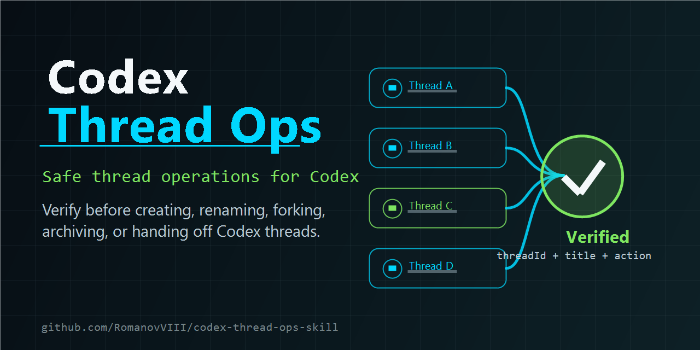

# Codex Thread Ops Skill

Prevent wrong-thread changes in Codex.



`codex-thread-ops` is a small Codex skill for safe thread-structure operations: create, rename, fork, archive, pin, hand off, message, select, and maintain project thread indexes such as `THREADS.md`.

It is built for people who use many Codex threads per project and want a guardrail before irreversible or confusing thread actions.

> Community skill. Not an official OpenAI project.

## Why It Exists

Thread management is easy to get wrong when several conversations have similar titles or when a handoff contains a `source_thread_id`. This skill makes Codex stop, verify the exact target, and name the action before changing a thread.

## What It Does

- Verifies `threadId`, current title, and requested action before a thread mutation.
- Avoids treating delegated `source_thread_id` values as the active thread.
- Proposes short, clear titles before creating or renaming threads.
- Keeps a project thread index updated when local project rules define one.
- Prefers reversible operations, such as archive, over deletion.
- Avoids triggering on ordinary phrases like "read the current thread".

## Quick Start

Ask Codex to install this skill from GitHub:

```text
Use $skill-installer to install RomanovVIII/codex-thread-ops-skill with path codex-thread-ops.
```

Restart Codex after installation so the skill is discovered.

## Download

Download the ready-to-use ZIP from the latest release:

[Download codex-thread-ops-skill.zip](https://github.com/RomanovVIII/codex-thread-ops-skill/releases/latest/download/codex-thread-ops-skill.zip)

Manual install:

1. Extract the ZIP.
2. Copy the `codex-thread-ops` folder into the skills directory that your Codex installation scans, commonly:

```text
~/.codex/skills/
```

3. Restart Codex.

## Example Prompts

```text
Use $codex-thread-ops to create a new thread for the database migration plan.
```

```text
Use $codex-thread-ops to rename the current thread. Suggest short titles first.
```

```text
Use $codex-thread-ops to archive the old deployment thread and update THREADS.md.
```

## When Not To Use It

Do not use this skill for normal conversation summaries or content work inside a thread:

- "read the current thread"
- "summarize this thread"
- "based on this thread, write a plan"

Those are conversation tasks, not thread-structure operations.

## Repository Layout

```text
codex-thread-ops/
  SKILL.md
  agents/
    openai.yaml
```

The repository README, license, and preview image live outside the skill folder so the installed skill stays focused.

## Support The Project

If this skill helps you avoid a wrong-thread rename, archive, or handoff, starring the repository helps other Codex users find it.

Issues and pull requests are welcome.

## License

MIT
