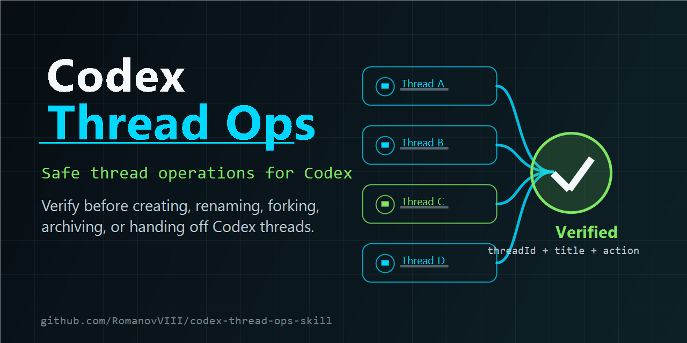

[English](README.md) | **Русский**

# 🧵 Codex Thread Ops Skill

[](https://github.com/RomanovVIII/codex-thread-ops-skill/stargazers)
[](LICENSE)

**Хватит терять контекст. Хватит плодить дублирующие треды.**



`codex-thread-ops` — community skill для тех, кто активно работает в Codex и ведёт много тредов по разным проектам. Он помогает не создавать дубли, не путаться в названиях, не выполнять действие не с тем тредом и не терять полезный контекст в долгих проектах.

**Коротко:** skill даёт Codex безопасный порядок для создания, переименования, fork, архивации, закрепления, handoff и ведения индекса проектных тредов.

⭐ **Если skill оказался полезным — поставьте репозиторию звезду.** Так другим пользователям Codex будет проще его найти.

> Community skill. Не является официальным проектом OpenAI.

## ⚡ Зачем это нужно

При активной работе в Codex список тредов быстро превращается в хаос. Через несколько десятков тредов уже сложно помнить, где обсуждалась нужная тема, какой тред актуален и куда безопасно переносить контекст.

Codex Thread Ops добавляет лёгкий рабочий слой для управления тредами, не превращая индекс тредов в ещё одну базу знаний.

## Что делает skill

`codex-thread-ops` даёт Codex рабочий порядок для гигиены тредов:

- помогает вести лёгкий индекс тредов проекта, обычно `THREADS.md`;
- фиксирует, какие активные треды существуют и о чём они;
- сверяет индекс с live-списком тредов Codex, когда меняется структура тредов;
- помогает выбрать: продолжить в существующем треде, создать новый или переименовать/архивировать старый;
- предлагает короткие и запоминающиеся названия тредов;
- перед изменением треда проверяет точную цель: `threadId`, текущее название и действие;
- не путает `source_thread_id` из делегирования с текущим тредом.

Индекс тредов не является базой знаний проекта. Это техническая карта Codex-разговоров, которая используется только при управлении структурой тредов.

## Типичные ситуации

- Вы хотите начать новый тред, но тема могла уже обсуждаться раньше.
- У вас накопилось много старых тредов, и часть нужно архивировать.
- Нужно короткое название, которое будет понятно через месяц.
- Нужно передать тему в другой тред без смешивания лишнего контекста.
- Нужно прописать проектные правила: когда читать и обновлять `THREADS.md`.

## Установка через Codex

```text
Use $skill-installer to install RomanovVIII/codex-thread-ops-skill with path codex-thread-ops.
```

После установки перезапустите Codex.

## Скачать ZIP

[Скачать codex-thread-ops-skill.zip](https://github.com/RomanovVIII/codex-thread-ops-skill/releases/latest/download/codex-thread-ops-skill.zip)

Ручная установка:

1. Распакуйте ZIP.
2. Скопируйте папку `codex-thread-ops` в директорию skills, которую сканирует ваш Codex, обычно:

```text
~/.codex/skills/
```

3. Перезапустите Codex.

## Примеры запросов

```text
Use $codex-thread-ops to check whether this topic already has a Codex thread.
```

```text
Use $codex-thread-ops to create a new thread for the database migration plan and suggest a short title first.
```

```text
Use $codex-thread-ops to archive stale threads and update THREADS.md.
```

## Когда не использовать

Этот skill не нужен для обычного чтения или пересказа текущего разговора:

- "read the current thread"
- "summarize this thread"
- "based on this thread, write a plan"

Это задачи по содержанию разговора, а не операции со структурой тредов.

## ⭐ Поддержать проект

Если Codex Thread Ops помогает вам избегать дублей, потери контекста или действий не с тем тредом — **поставьте репозиторию ⭐**.

Отзывы, идеи, Issues и Pull Requests приветствуются.

## Лицензия

MIT
